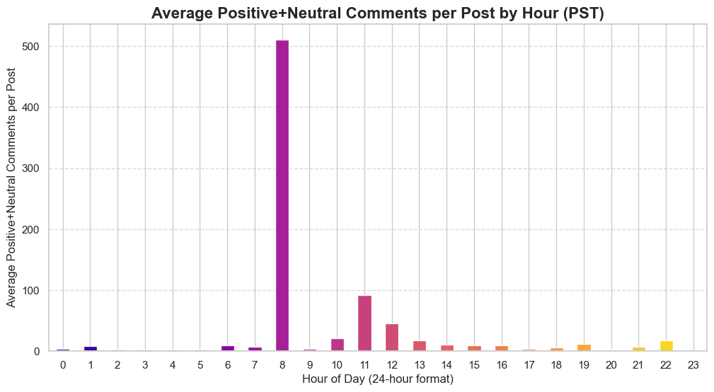
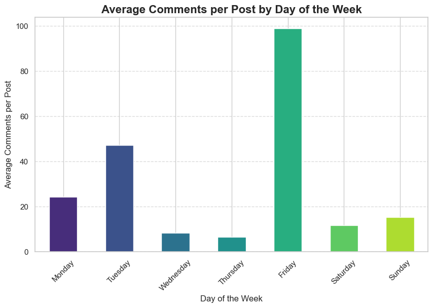
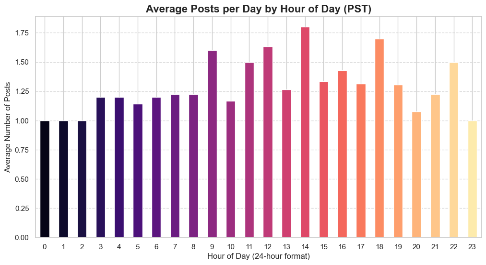
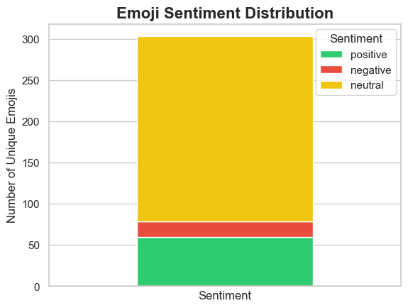

# Tree Hut Instagram Comment Analysis Report

## Top 25 Bigrams in User Comments

- `pr pr`: 4258
- `april fools`: 141
- `pr treehutpr`: 107
- `treehutpr pr`: 107
- `would love`: 91
- `moroccan rose`: 70
- `coco colada`: 65
- `trent pr`: 56
- `pr love`: 54
- `please send`: 51
- `smells good`: 50
- `pr trent`: 50
- `send friend`: 49
- `friend request`: 49
- `love products`: 48
- `hello please`: 47
- `request text`: 47
- `text messenger`: 47
- `messenger question`: 47
- `question ask`: 47
- `ask private`: 47
- `fools joke`: 47
- `love love`: 46
- `bring back`: 45
- `cant wait`: 42

## Top 25 Trigrams in User Comments

- `pr pr pr`: 3569
- `pr treehutpr pr`: 90
- `pr pr treehutpr`: 88
- `treehutpr pr pr`: 86
- `pr trent pr`: 50
- `send friend request`: 49
- `please send friend`: 48
- `trent pr pr`: 47
- `hello please send`: 47
- `friend request text`: 47
- `request text messenger`: 47
- `text messenger question`: 47
- `messenger question ask`: 47
- `question ask private`: 47
- `april fools joke`: 46
- `pr pr trent`: 39
- `pr pr love`: 32
- `ask private pr`: 25
- `love pr pr`: 20
- `pr pr omg`: 17
- `pr pr please`: 17
- `please pr pr`: 17
- `private pr pr`: 17
- `cant wait try`: 16
- `wan na try`: 14

## Average Positive+Neutral Comments per Post by Hour (PST)

## Average Positive+Neutral Comments per Post by Day of Week

## Average Posts per Day by Hour (PST)

## Emoji Sentiment Distribution

## Emoji Sentiment Classification Key

**Positive Emojis**: ☺️ (:smiling face:) ♥️ (:heart suit:) ✋ (:raised hand:) ✋🏼 (:raised hand: medium-light skin tone:) ✨ (:sparkles:) ❣️ (:heart exclamation:) ❤ (:red heart:) 🎁 (:wrapped gift:) 🎉 (:party popper:) 👋 (:waving hand:) 👌 (:OK hand:) 👌🏼 (:OK hand: medium-light skin tone:) 💁🏻‍♀️ (:woman tipping hand: light skin tone:) 💁🏽 (:person tipping hand: medium skin tone:) 💋 (:kiss mark:) 💌 (:love letter:) 💓 (:beating heart:) 💔 (:broken heart:) 💕 (:two hearts:) 💖 (:sparkling heart:) 💗 (:growing heart:) 💘 (:heart with arrow:) 💙 (:blue heart:) 💚 (:green heart:) 💛 (:yellow heart:) 💜 (:purple heart:) 💝 (:heart with ribbon:) 💞 (:revolving hearts:) 🖤 (:black heart:) 😀 (:grinning face:) 😁 (:beaming face with smiling eyes:) 😂 (:face with tears of joy:) 😃 (:grinning face with big eyes:) 😄 (:grinning face with smiling eyes:) 😅 (:grinning face with sweat:) 😆 (:grinning squinting face:) 😇 (:smiling face with halo:) 😈 (:smiling face with horns:) 😊 (:smiling face with smiling eyes:) 😌 (:relieved face:) 😍 (:smiling face with heart-eyes:) 😎 (:smiling face with sunglasses:) 😔 (:pensive face:) 😗 (:kissing face:) 😘 (:face blowing a kiss:) 😙 (:kissing face with smiling eyes:) 😚 (:kissing face with closed eyes:) 😲 (:astonished face:) 😻 (:smiling cat with heart-eyes:) 😽 (:kissing cat:) 🙂 (:slightly smiling face:) 🤗 (:hugging face:) 🤙 (:call me hand:) 🤚 (:raised back of hand:) 🤣 (:rolling on the floor laughing:) 🤭 (:face with hand over mouth:) 🥇 (:1st place medal:) 🥰 (:smiling face with hearts:) 🥳 (:partying face:) 🧡 (:orange heart:)

**Negative Emojis**: ☹️ (:frowning face:) ❤️‍🔥 (:heart on fire:) 💣 (:bomb:) 💥 (:collision:) 💫 (:dizzy:) 🔥 (:fire:) 😕 (:confused face:) 😞 (:disappointed face:) 😟 (:worried face:) 😠 (:angry face:) 😢 (:crying face:) 😦 (:frowning face with open mouth:) 😧 (:anguished face:) 😨 (:fearful face:) 😩 (:weary face:) 😫 (:tired face:) 😭 (:loudly crying face:) 😱 (:face screaming in fear:) 🙁 (:slightly frowning face:)

**Neutral Emojis**: ‼️ (:double exclamation mark:) ⁉️ (:exclamation question mark:) ↔️ (:left-right arrow:) ↕️ (:up-down arrow:) ▪ (:black small square:) ☀️ (:sun:) ☕ (:hot beverage:) ☘️ (:shamrock:) ☝🏼 (:index pointing up: medium-light skin tone:) ⛱️ (:umbrella on ground:) ✅ (:check mark button:) ✉️ (:envelope:) ✊🏼 (:raised fist: medium-light skin tone:) ✌️ (:victory hand:) ✔ (:check mark:) ✔️ (:check mark:) ✝️ (:latin cross:) ❓ (:red question mark:) ❤️ (:red heart:) ➡️ (:right arrow:) ⬇️ (:down arrow:) ⭐ (:star:) 🆙 (:UP! button:) 🇧🇷 (:flag: Brazil:) 🇨🇦 (:flag: Canada:) 🇬🇧 (:flag: United Kingdom:) 🇯🇲 (:flag: Jamaica:) 🇳🇬 (:flag: Nigeria:) 🇺🇸 (:flag: United States:) 🌅 (:sunrise:) 🌈 (:rainbow:) 🌊 (:water wave:) 🌚 (:new moon face:) 🌞 (:sun with face:) 🌟 (:glowing star:) 🌱 (:seedling:) 🌲 (:evergreen tree:) 🌳 (:deciduous tree:) 🌴 (:palm tree:) 🌵 (:cactus:) 🌷 (:tulip:) 🌸 (:cherry blossom:) 🌹 (:rose:) 🌺 (:hibiscus:) 🌻 (:sunflower:) 🌼 (:blossom:) 🌽 (:ear of corn:) 🌾 (:sheaf of rice:) 🌿 (:herb:) 🍀 (:four leaf clover:) 🍁 (:maple leaf:) 🍃 (:leaf fluttering in wind:) 🍇 (:grapes:) 🍉 (:watermelon:) 🍊 (:tangerine:) 🍋 (:lemon:) 🍌 (:banana:) 🍍 (:pineapple:) 🍎 (:red apple:) 🍒 (:cherries:) 🍓 (:strawberry:) 🍦 (:soft ice cream:) 🍪 (:cookie:) 🍬 (:candy:) 🍭 (:lollipop:) 🍸 (:cocktail glass:) 🍹 (:tropical drink:) 🎀 (:ribbon:) 🎂 (:birthday cake:) 🎃 (:jack-o-lantern:) 🎈 (:balloon:) 🎯 (:bullseye:) 🏃🏻‍♀️ (:woman running: light skin tone:) 🏃🏾‍♀️ (:woman running: medium-dark skin tone:) 🏖 (:beach with umbrella:) 🏝 (:desert island:) 🏝️ (:desert island:) 🏰 (:castle:) 🏵️ (:rosette:) 🏻 (:light skin tone:) 🏼 (:medium-light skin tone:) 🏽 (:medium skin tone:) 🏾 (:medium-dark skin tone:) 🐠 (:tropical fish:) 🐳 (:spouting whale:) 🐸 (:frog:) 🐾 (:paw prints:) 👀 (:eyes:) 👁️ (:eye:) 👃 (:nose:) 👄 (:mouth:) 👇 (:backhand index pointing down:) 👉 (:backhand index pointing right:) 👍 (:thumbs up:) 👍🏼 (:thumbs up: medium-light skin tone:) 👍🏾 (:thumbs up: medium-dark skin tone:) 👎 (:thumbs down:) 👏 (:clapping hands:) 👏🏻 (:clapping hands: light skin tone:) 👏🏼 (:clapping hands: medium-light skin tone:) 👏🏽 (:clapping hands: medium skin tone:) 👑 (:crown:) 👙 (:bikini:) 👛 (:purse:) 👩🏽‍🦯 (:woman with white cane: medium skin tone:) 👰‍♀️ (:woman with veil:) 💀 (:skull:) 💃🏻 (:woman dancing: light skin tone:) 💃🏽 (:woman dancing: medium skin tone:) 💄 (:lipstick:) 💅 (:nail polish:) 💍 (:ring:) 💐 (:bouquet:) 💡 (:light bulb:) 💦 (:sweat droplets:) 💧 (:droplet:) 💨 (:dashing away:) 💪 (:flexed biceps:) 💯 (:hundred points:) 💵 (:dollar banknote:) 📣 (:megaphone:) 🔑 (:key:) 🕊️ (:dove:) 🕶️ (:sunglasses:) 🕺 (:man dancing:) 🗑️ (:wastebasket:) 🗣️ (:speaking head:) 😉 (:winking face:) 😋 (:face savoring food:) 😏 (:smirking face:) 😐 (:neutral face:) 😑 (:expressionless face:) 😒 (:unamused face:) 😖 (:confounded face:) 😛 (:face with tongue:) 😜 (:winking face with tongue:) 😝 (:squinting face with tongue:) 😡 (:pouting face:) 😤 (:face with steam from nose:) 😪 (:sleepy face:) 😮 (:face with open mouth:) 😮‍💨 (:face exhaling:) 😳 (:flushed face:) 🙃 (:upside-down face:) 🙄 (:face with rolling eyes:) 🙊 (:speak-no-evil monkey:) 🙌 (:raising hands:) 🙌🏻 (:raising hands: light skin tone:) 🙌🏼 (:raising hands: medium-light skin tone:) 🙌🏽 (:raising hands: medium skin tone:) 🙌🏾 (:raising hands: medium-dark skin tone:) 🙏 (:folded hands:) 🙏🏻 (:folded hands: light skin tone:) 🙏🏼 (:folded hands: medium-light skin tone:) 🙏🏽 (:folded hands: medium skin tone:) 🙏🏾 (:folded hands: medium-dark skin tone:) 🚫 (:prohibited:) 🚮 (:litter in bin sign:) 🚴 (:person biking:) 🚿 (:shower:) 🛀 (:person taking bath:) 🛀🏼 (:person taking bath: medium-light skin tone:) 🛁 (:bathtub:) 🛍️ (:shopping bags:) 🛒 (:shopping cart:) 🛖 (:hut:) 🟢 (:green circle:) 🟩 (:green square:) 🤌 (:pinched fingers:) 🤌🏼 (:pinched fingers: medium-light skin tone:) 🤍 (:white heart:) 🤎 (:brown heart:) 🤑 (:money-mouth face:) 🤔 (:thinking face:) 🤞 (:crossed fingers:) 🤞🏻 (:crossed fingers: light skin tone:) 🤞🏼 (:crossed fingers: medium-light skin tone:) 🤞🏽 (:crossed fingers: medium skin tone:) 🤞🏾 (:crossed fingers: medium-dark skin tone:) 🤟🏻 (:love-you gesture: light skin tone:) 🤟🏾 (:love-you gesture: medium-dark skin tone:) 🤢 (:nauseated face:) 🤤 (:drooling face:) 🤦‍♀️ (:woman facepalming:) 🤦🏻‍♀️ (:woman facepalming: light skin tone:) 🤦🏼‍♀️ (:woman facepalming: medium-light skin tone:) 🤧 (:sneezing face:) 🤨 (:face with raised eyebrow:) 🤩 (:star-struck:) 🤪 (:zany face:) 🤬 (:face with symbols on mouth:) 🤮 (:face vomiting:) 🤯 (:exploding head:) 🤲🏽 (:palms up together: medium skin tone:) 🤷‍♀️ (:woman shrugging:) 🤷🏻‍♀️ (:woman shrugging: light skin tone:) 🤷🏼‍♀️ (:woman shrugging: medium-light skin tone:) 🤷🏽‍♀️ (:woman shrugging: medium skin tone:) 🤷🏾‍♀️ (:woman shrugging: medium-dark skin tone:) 🥀 (:wilted flower:) 🥥 (:coconut:) 🥲 (:smiling face with tear:) 🥴 (:woozy face:) 🥵 (:hot face:) 🥺 (:pleading face:) 🦋 (:butterfly:) 🧉 (:mate:) 🧍‍♀️ (:woman standing:) 🧍🏻‍♀️ (:woman standing: light skin tone:) 🧐 (:face with monocle:) 🧖‍♀️ (:woman in steamy room:) 🧖🏻‍♀️ (:woman in steamy room: light skin tone:) 🧖🏽‍♀️ (:woman in steamy room: medium skin tone:) 🧚🏻 (:fairy: light skin tone:) 🧚🏾 (:fairy: medium-dark skin tone:) 🧪 (:test tube:) 🧴 (:lotion bottle:) 🧸 (:teddy bear:) 🧺 (:basket:) 🧼 (:soap:) 🪒 (:razor:) 🪞 (:mirror:) 🪴 (:potted plant:) 🫐 (:blueberries:)

## Top 25 Most Used Emojis

- 😍: 887
- ❤️: 659
- ✨: 433
- 💕: 251
- 🔥: 215
- 🙌: 181
- 😭: 121
- 🤍: 115
- 😂: 112
- 🥰: 97
- 👏: 69
- 🌺: 60
- ☀️: 59
- 🤩: 57
- 🌴: 55
- 😢: 47
- 🥥: 47
- 💗: 43
- 💖: 42
- 🧡: 42
- 🌹: 37
- 🤭: 36
- 👀: 35
- 🤣: 34
- 💚: 27

## Discovered Topics in User Comments

**0_pr_treehut_tree_hut**: `pr`, `treehut`, `tree`, `hut`, `treehutpr`, `love`, `products`, `much`, `would`, `please`

**1_love_need_omg_bestie**: `love`, `need`, `omg`, `bestie`, `favorite`, `stuff`, `marie`, `looks`, `best`, `oh`

**2_scent_smells_glow_rose**: `scent`, `smells`, `glow`, `rose`, `moroccan`, `smell`, `pineapple`, `tangerine`, `one`, `good`

**3_need_try_found_would**: `need`, `try`, `found`, `would`, `want`, `done`, `get`, `one`, `love`, `please`

**4_real_yes_joke_omg**: `real`, `yes`, `joke`, `omg`, `yesss`, `yessss`, `please`, `make`, `yesssss`, `fake`

**5_scrub_body_skin_scrubs**: `scrub`, `body`, `skin`, `scrubs`, `oil`, `sugar`, `butter`, `shave`, `love`, `wash`

**6_walmart_buy_products_target**: `walmart`, `buy`, `products`, `target`, `product`, `ulta`, `love`, `brand`, `tonya`, `amazon`

**7_fools_april_joke_isnt**: `fools`, `april`, `joke`, `isnt`, `prank`, `hope`, `aprils`, `day`, `lol`, `would`

**8_trent_threehut_pr_trehut**: `trent`, `threehut`, `pr`, `trehut`, `theehut`, `teehut`, `list`, `truehut`, `teeehut`, `plz`

**9_coco_colada_vanilla_coca**: `coco`, `colada`, `vanilla`, `coca`, `love`, `one`, `loves`, `daughter`, `calada`, `niece`

**10_spring_going_florida_break**: `spring`, `going`, `florida`, `break`, `summer`, `family`, `im`, `vacation`, `canada`, `lake`

**11_friend_hello_request_private**: `friend`, `hello`, `request`, `private`, `text`, `messenger`, `ask`, `question`, `send`, `please`

**12_win_wait_cant_giveaway**: `win`, `wait`, `cant`, `giveaway`, `birthday`, `would`, `love`, `try`, `giveaways`, `add`

**13_neutral_chaotic_evil_good**: `neutral`, `chaotic`, `evil`, `good`, `lawful`, `cough`, `true`, `sure`, `im`, `mixed`

**14_na_wan_collab_gon**: `na`, `wan`, `collab`, `gon`, `fr`, `try`, `song`, `frrr`, `bad`, `much`

**15_back_bring_tahitian_sweet**: `back`, `bring`, `tahitian`, `sweet`, `cream`, `please`, `vanilla`, `revert`, `kindly`, `bean`

**16_play_playing_dont_emotions**: `play`, `playing`, `dont`, `emotions`, `yall`, `stop`, `regret`, `like`, `wont`, `soinds`

**17_face_use_used_also**: `face`, `use`, `used`, `also`, `trizerl`, `sink`, `katiku`, `including`, `uses`, `remarkable`

**18_gif_model_caption_slide**: `gif`, `model`, `caption`, `slide`, `second`, `link`, ``, ``, ``, ``

## Discovered Topics in Brand Captions

**0_pr_applications_open_send**: `pr`, `applications`, `open`, `send`, `well`, `list`, `news`, `closed`, `big`, `applied`

**1_skin_dry_skins_martini**: `skin`, `dry`, `skins`, `martini`, `grinds`, `meet`, `collectionyour`, `latenight`, `pickmeup`, `relate`

**2_thats_espresso_tipo_gosta**: `thats`, `espresso`, `tipo`, `gosta`, `conteúdo`, `banho`, `amo`, `eu`, `faz`, `já`

**3_instagram_spring_break_giveaway**: `instagram`, `spring`, `break`, `giveaway`, `post`, `winners`, `enter`, `collection`, `shop`, `everything`

**4_hut_tree_instore_online**: `hut`, `tree`, `instore`, `online`, `available`, `routine`, `morning`, `nightly`, `section`, `exactly`

**5_lips_lip_overnight_mask**: `lips`, `lip`, `overnight`, `mask`, `wake`, `soft`, `instagram`, `ready`, `make`, `right`

**6_selfcare_chaotic_good_neutral**: `selfcare`, `chaotic`, `good`, `neutral`, `somewhere`, `alignment`, `whats`, `freshening`, `routine`, `deserves`

**7_notes_im_scrub_bear**: `notes`, `im`, `scrub`, `bear`, `jelly`, `yeah`, `oh`, `use`, `scrubs`, `one`

**8_away_instagram_spritz_bad**: `away`, `instagram`, `spritz`, `bad`, `keeps`, `smells`, `day`, `mist`, `latest`, `fragrance`

**9_youre_obsessed_plantbased_lotus**: `youre`, `obsessed`, `plantbased`, `lotus`, `water`, `nourishing`, `hydration`, `selfcare`, `available`, `drop`

**10_sugar_slams_shut_laptop**: `sugar`, `slams`, `shut`, `laptop`, `click`, `scrub`, `fave`, `get`, `watching`, `rush`

**11_toe_someshellyphotography_required_radiance**: `toe`, `someshellyphotography`, `required`, `radiance`, `passport`, `leaving`, `bathroom`, `sunkissed`, `head`, `without`

**12_ratings_agree__**: `ratings`, `agree`, ``, ``, ``, ``, ``, ``, ``, ``

**13_many_right_get_said**: `many`, `right`, `get`, `said`, `watch`, `times`, `yes`, ``, ``, ``

**14_red_spotted_icons_carpet**: `red`, `spotted`, `icons`, `carpet`, `oscars`, `many`, ``, ``, ``, ``

**15_whove_common_arent_tried**: `whove`, `common`, `arent`, `tried`, `ones`, `know`, ``, ``, ``, ``

**16_part_favorite__**: `part`, `favorite`, ``, ``, ``, ``, ``, ``, ``, ``

**17_things_im_might_feed**: `things`, `im`, `might`, `feed`, `photos`, `using`, `page`, `leahjane`, `talking`, `featured`

**18_babes_perfection_simply_rush**: `babes`, `perfection`, `simply`, `rush`, `cant`, `ready`, `sea`, `already`, `routineno`, `matter`

## Caption Topics vs. Top Comment Trigrams & Engagement

| Topic                                          | Top 5 Comment Trigrams                                                                                                        |   Avg Comments/Post |
|:-----------------------------------------------|:------------------------------------------------------------------------------------------------------------------------------|--------------------:|
| 0_pr_applications_open_send                    | `pr pr pr`, `pr pr treehutpr`, `pr treehutpr pr`, `april fools joke`, `treehutpr pr pr`                                       |               71.31 |
| 10_sugar_slams_shut_laptop                     | `pr pr pr`, `pr would love`, `would love pr`, `love pr pr`, `anyone know song`                                                |              257.03 |
| 11_toe_someshellyphotography_required_radiance | `pr pr pr`, `leah meyers welp`, `meyers welp goes`, `welp goes money`, `goes money cyndi`                                     |              266.09 |
| 12_ratings_agree__                             | `ok make one`, `make one im`, `one im living`, `im living patti`, `living patti anne`                                         |              678.75 |
| 13_many_right_get_said                         | `pr pr pr`, `yes fun spring`, `fun spring break`, `spring break plans`, `break plans relax`                                   |              420.4  |
| 14_red_spotted_icons_carpet                    | `pr pr pr`, `available cella deshay`, `cella deshay yes`, `deshay yes yessss`, `yes yessss dont`                              |              358.37 |
| 15_whove_common_arent_tried                    | `darice elmore use`, `elmore use shampoo`, `use shampoo conditioner`, `shampoo conditioner well`, `conditioner well moroccan` |              118    |
| 16_part_favorite__                             | `pr pr pr`, `yep found pr`, `found pr pr`, `pr pr love`, `pr love devi`                                                       |             1243.33 |
| 17_things_im_might_feed                        | `talk ur self`, `ur self going`, `self going florida`, `going florida pr`, `florida pr pr`                                    |             1056.83 |
| 18_babes_perfection_simply_rush                | `bet smells wonderful`, `smells wonderful need`, `wonderful need pr`, `need pr cutee`, `pr cutee pr`                          |             1997.33 |
| 1_skin_dry_skins_martini                       | `pr pr pr`, `pr pr treehutpr`, `hello please send`, `please send friend`, `send friend request`                               |               89.57 |
| 2_thats_espresso_tipo_gosta                    | `pr pr pr`, `hello please send`, `please send friend`, `send friend request`, `friend request text`                           |              282.77 |
| 3_instagram_spring_break_giveaway              | `pr pr pr`, `pr treehutpr pr`, `pr pr treehutpr`, `treehutpr pr pr`, `pr trent pr`                                            |               98.68 |
| 4_hut_tree_instore_online                      | `pr pr pr`, `pr pr treehutpr`, `pr treehutpr pr`, `pr trent pr`, `bet smells good`                                            |              145.24 |
| 5_lips_lip_overnight_mask                      | `pr pr pr`, `treehur pr pr`, `pr pr treehutpr`, `got ta try`, `ta try smell`                                                  |              163.32 |
| 6_selfcare_chaotic_good_neutral                | `pr pr pr`, `pr pr done`, `pr please pr`, `set please favorite`, `please favorite one`                                        |              219.77 |
| 7_notes_im_scrub_bear                          | `pr pr pr`, `hiiiiiii love products`, `love products much`, `products much scrubs`, `much scrubs amazing`                     |              146.51 |
| 8_away_instagram_spritz_bad                    | `pr pr pr`, `hello please send`, `please send friend`, `send friend request`, `friend request text`                           |              463.56 |
| 9_youre_obsessed_plantbased_lotus              | `pr pr pr`, `love pr pr`, `fear bestie much`, `bestie much fun`, `much fun one`                                               |              216.82 |

## Brand Caption Topics vs. User Engagement

| Caption Topic                                  |   Avg Comments/Post |
|:-----------------------------------------------|--------------------:|
| 0_pr_applications_open_send                    |             2723.86 |
| 1_skin_dry_skins_martini                       |             3422.59 |
| 2_thats_espresso_tipo_gosta                    |             5402.56 |
| 3_instagram_spring_break_giveaway              |             2637.11 |
| 4_hut_tree_instore_online                      |             2803.07 |
| 5_lips_lip_overnight_mask                      |             2972.65 |
| 6_selfcare_chaotic_good_neutral                |             3087.12 |
| 7_notes_im_scrub_bear                          |             2406.14 |
| 8_away_instagram_spritz_bad                    |             4214.83 |
| 9_youre_obsessed_plantbased_lotus              |             2184.29 |
| 10_sugar_slams_shut_laptop                     |             2629.07 |
| 11_toe_someshellyphotography_required_radiance |              708.57 |
| 12_ratings_agree__                             |              848.59 |
| 13_many_right_get_said                         |             1609.14 |
| 14_red_spotted_icons_carpet                    |             3115.4  |
| 15_whove_common_arent_tried                    |              164    |
| 16_part_favorite__                             |             3133.69 |
| 17_things_im_might_feed                        |             2602.22 |
| 18_babes_perfection_simply_rush                |             3845.17 |